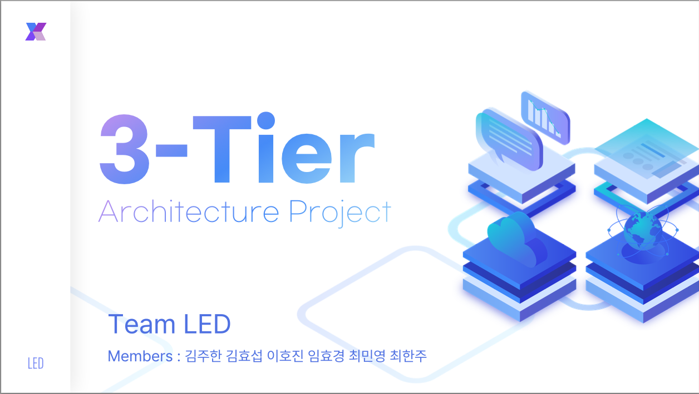
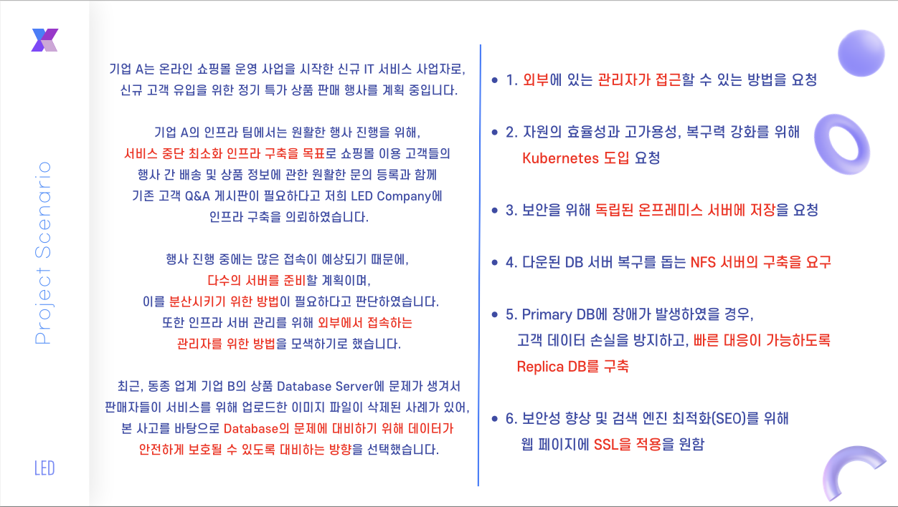

# k8s-onprem-3tier_InfraSystem

## 프로젝트 배경

기업 A는 온라인 쇼핑몰 운영 사업을 시작한 신규 IT 서비스 사업자로, 신규 고객 유입을 위한 정기 특가 상품 판매 행사를 진행할 예정입니다. 이를 위해 무중단 인프라 구축과 효율적인 트래픽 분산이 필요합니다. 기존 서버 이중화 솔루션을 통해 FT (Fault Tolerance) 솔루션을 도입하여 대량의 트래픽을 처리하고자 합니다. 또한, 서버 장애 발생 시에도 데이터 손실을 최소화하기 위해 백업 시스템을 구축할 예정입니다.

## 목표

1. 단합과 협동을 통한 팀워크 증진(Hot-Spot Line을 이용하여 전체 인프라 연결)
2. 학습 내용의 활용을 통한 복습(현재까지 진행된 교육 과정의 교육 내용을 참고)
3. 배우지 않은 기술의 개인 학습 및 적용(관련 자료 및 기술 문서 확인)
4. Wi-Fi 공유기를 경유한 로컬 PC 간의 연결을 통해 구축하는 확장 네트워크 및 자원 공유
5. 교육과정에서 학습한 기술의 실제 적용을 통한 실무 경험

## 시나리오

## 구성도

## 주요 변경 사항 및 고려 사항

- 현재 온프레미스 환경에서 WEB 서비스용 머신과 WAS 서비스용 머신을 별도로 운영 중
- Kubernetes 도입을 고려하여 인프라 구성 변경 필요
- 특가 상품 판매 이벤트 시 동적인 트래픽 처리와 확장이 필요함
- 고객 데이터 보안 및 백업 필요
- 웹 페이지 업데이트가 빈번하게 이루어지며, 버전 업데이트 용이성이 요구됨
- 웹 페이지에 SSL을 적용하여 보안성 향상 및 검색 엔진 최적화(SEO) 필요

## 핵심 동작

- 고객 데이터베이스의 모든 정보 입력은 Kubernetes 환경에서 진행됩니다.
- 트래픽 과부하 위험 탐지 시, 인프라 팀의 시스템 관리자는 Slack API를 통해 경고 알림을 받습니다.
- 트래픽 과부하 발생 시, CPU 사용량 증가에 대비해 자동으로 새로운 Pod가 생성됩니다.
- 고객 데이터베이스에 대한 접근은 반드시 IPSec 통신 방식을 사용하는 VPN 연결이 필요합니다.
- 데이터베이스의 백업 방식으로는 주기적인 스냅샷과 함께, 필요에 따라 Blue/Green 또는 카나리 배포 방식을 적용하여 데이터베이스의 버전 업그레이드를 진행할 수 있습니다. 이를 통해, 중요한 데이터의 안전성을 보장하고, 업그레이드 과정에서 발생할 수 있는 문제를 최소화할 수 있습니다.

## 결과
1. 외부에서 공개된 IP를 통하여 내부의 Bastion Host로 SSH연결을 수행할 수 있다.
2. K8S 클러스터를 구현하여 자원의 효율성과 고가용성, 복구력을 향상시켰습니다.
3. 온프레미스로 DB를 구현하여 보안과, 복구능력, 고 가용성을 향상시켰습니다.
4. NFS를 구축하여 다운된 DB 서버의 복구를 도울 수 있게 되었습니다.
5. Replica DB를 구현하여 고객 데이터 손실을 방지하고 장애에 대비할 수 있게 되었습니다.
6. LB를 구축하여 트래픽을 분산 처리할 수 있게 되었고, SSL을 LB에 적용하여 보안성 향상 및 검색 엔진 최적화(SEO)를 향상시켰습니다.
